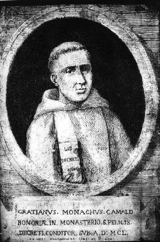

# the Gratian project

## PCA

Sandbox for principal component analysis

### Notes

+ Kestemont's wordlist.txt is a list of lemmas not words
+ Kestemont used Morfette (Haskell) for lemmatization
+ *qui* is an allowed lemma
+ *hic* is an allowed lemma but *ille* and *iste* are not (inconsistent)
+ *que* = *quae*? *hec* = *haec*?
---
+ The R `file.copy()` function requires the `overwrite = TRUE` option even if the Unix file permissions would otherwise allow an existing file to be overwritten, e.g.: `file.copy("source.txt", "dest.txt", "overwrite = TRUE")`
---
+ `custom.graph.title` works if `pca.visual.flavour = "classic",` or `pca.visual.flavour = "loadings",`
+ `custom.graph.title` does not work if `pca.visual.flavour = "symbols",`
+ Toggle test scripts from `gui = TRUE,` to `gui = FALSE,` before incorporating into `final.R`
+ Use either `features = "wordlists/existing_wordlist.txt",` or `use.existing.wordlist = TRUE,` but not both (mutually exclusive)
